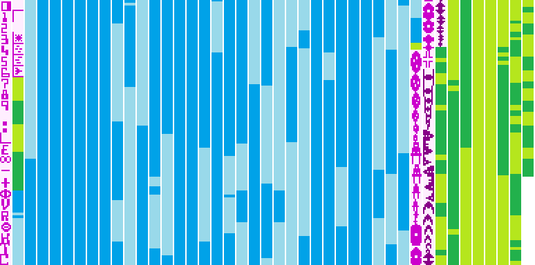

## Reverse Engineered And Fully Documented STAR RAIDERS Source Code

STAR RAIDERS is a seminal computer game, published by Atari Inc. in 1979 as one of the first titles for the original Atari 8-bit Home Computer System (Atari 400 and 800).

During the last years, as a hobby afterhours project, I reverse engineered a complete, extensively documented assembly language source code of STAR RAIDERS. I reverse engineered the source code directly from the binary file of the ROM cartridge, finishing it in September 2015. 

This repo contains both the reverse engineered
* assembly source code input ([StarRaiders.source.asm.txt](StarRaiders.source.asm.txt)) and
* assembly source code output ([StarRaiders.source.txt](StarRaiders.source.txt)).

You may find this useful if you are curious about the internals of STAR RAIDERS or if you are planning to make your own, modified version.

After very positive reader feedback on the initial release of my reverse engineered source code I reviewed it again, resulting in a minor update.

Enjoy -- Lorenz

_PS: I was absolutely thrilled to learn that in October 2015 [scans of the original STAR RAIDERS source code](https://archive.org/details/AtariStarRaidersSourceCode) re-surfaced._

_To my delight, inspection of the original source code confirmed the findings of my reverse engineered version and caused only a few trivial corrections._

_Even more, the documentation of my reverse engineered version adds a substantial amount of information - from overall theory of operation down to some tricky details - to the understanding of the often sparsely commented original (quite expected for source code never meant for publication). So, if you are interested in learning how STAR RAIDERS works, my reverse engineered source code could be of help to you._

### Genome Sequence

The picture below shows the "genome sequence" of the reverse engineered STAR RAIDERS 8 KB ROM (which I prepared for a  [publication](https://archive.org/details/pocorgtfo13)). I stacked the 8192 bytes vertically, with each byte represented by a tiny, solid horizontal line of 8 pixels. Then, I split the stack into strips of 192 bytes, arranged side-by-side. The segments of the stack are color-coded:
* Code (main game loop and subroutines) is in alternating shades of blue.
* Data (lookup tables, texts, etc.) is in alternating shades of green.
* Bitmap data (Player-Missile shapes and character set) is in alternating shades of purple and the solid line of a byte is replaced by its actual bit pattern.

### References to This Project

* [Star Raiders Tribute Page](http://www.sonic.net/~nbs/star-raiders/)
* [Atari Wiki - Star Raiders](http://atariwiki.org/wiki/Wiki.jsp?page=Star%20Raiders)
* [Atari Wiki - Star Raiders source code by Lorenz Wiest](http://atariwiki.org/wiki/Wiki.jsp?page=Star%20Raiders%20source%20code%20by%20Lorenz%20Wiest)
* [AtariAge Forum - Star Raiders Source Code to be released?](http://atariage.com/forums/topic/243904-star-raiders-source-code-to-be-released/page-9#entry3422364)
* [AtariAge Forum - Fully documented, reverse-engineered STAR RAIDERS source code available](http://atariage.com/forums/topic/251001-fully-documented-reverse-engineered-star-raiders-source-code-available/)
* [Wikipedia "Star Raiders"](https://en.wikipedia.org/wiki/Star_Raiders#Source_code)
* [ANTIC The Atari 8-bit Podcast](http://ataripodcast.libsyn.com/webpage/2016/02/21)
* [Brainwagon - Deconstructing the Classic Atari Game: Star Raiders](http://brainwagon.org/2013/11/17/deconstructing-the-classic-atari-game-star-raiders/)
* [Article "Reverse Engineering Star Raiders", PoC||GTFO 0x13, p. 5-20, October 2016](https://archive.org/details/pocorgtfo13)
